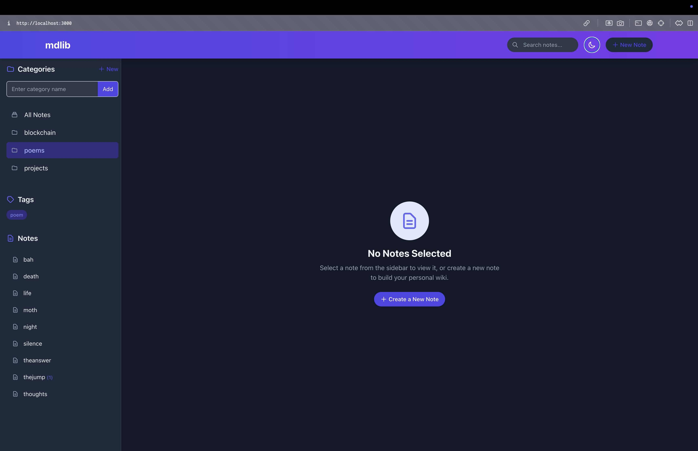

# mdlib - Your personal wiki/ md library

A beautiful, web-based tool for creating, editing, and organizing markdown notes with real-time preview.



## Features

- 📝 Browse and edit markdown files in a directory
- ✨ Create new markdown files
- 👁️ Preview markdown rendering in real-time
- 🔍 Search across all your notes
- 🏷️ Tag support for better organization
- 📂 Category support for hierarchical organization
- 🌙 Dark mode support
- ⚡ Keyboard shortcuts for quick actions
- 🔄 Auto-save functionality
- 💾 Simple file management
- 📱 Responsive design for all device sizes
- 🔍 Full-text search capabilities
- 🔗 Easy navigation between linked notes
- 📄 YAML frontmatter support
- 🧩 Customizable configuration
- 📦 Embedded web assets - run from any directory

## Getting Started

### Prerequisites

- Rust and Cargo (1.54.0 or newer)

### Installation

#### Via cargo install

The simplest way to install mdlib is through cargo:

```bash
cargo install mdlib
```

Once installed, you can run `mdlib` from any directory to serve that directory's markdown files.

#### Building from source

1. Clone the repository (or download the source code):

```bash
git clone https://github.com/bahdotsh/mdlib.git
cd mdlib
```

2. Build the project:

```bash
cargo build --release
```

The compiled binary will be located in `target/release/mdlib`.

### Usage

To start mdlib, run:

```bash
mdlib [DIRECTORY]
```

Where `[DIRECTORY]` is the path to the directory containing your markdown files. If not specified, the current directory is used.

You can also specify a custom configuration file:

```bash
mdlib --config-file /path/to/config.json [DIRECTORY]
```

Once started, open your browser and navigate to [http://localhost:3000](http://localhost:3000).

#### Configuration Commands

mdlib includes special commands to manage your configuration:

```bash
# Show config file location and current settings
mdlib --config

# Create a default config file
mdlib --config create

# List all embedded static files (for debugging)
mdlib --list-embedded
```

## Keyboard Shortcuts

- `Ctrl/Cmd + S`: Save current file
- `Ctrl/Cmd + B`: Bold selected text
- `Ctrl/Cmd + I`: Italicize selected text
- `Ctrl/Cmd + P`: Toggle preview mode
- `Ctrl/Cmd + N`: Create new note

## Development

### Project Structure

- `src/`: Source code
  - `main.rs`: Entry point
  - `fs.rs`: File system operations
  - `server.rs`: Web server and API endpoints
  - `config.rs`: Configuration management
  - `embedded.rs`: Embedded static assets handler
- `static/`: Static web files (embedded into the binary at compile time)
  - `index.html`: Main HTML page
  - `css/`: Stylesheets
  - `js/`: JavaScript files

### Building from Source

```bash
# Clone the repository
git clone https://github.com/bahdotsh/mdlib.git
cd mdlib

# Build the project
cargo build --release

# Run the application
./target/release/mdlib
```

## Configuration

You can specify a custom configuration file with the `--config-file` option:

```bash
mdlib --config-file /path/to/config.json
```

Configuration options include:
- Server port
- Bind address
- File watching
- Maximum file size
- Default theme preference

### Sample Configuration

Here's a sample `config.json` file with default settings:

```json
{
  "port": 3000,
  "watch_files": true,
  "bind_address": "127.0.0.1",
  "max_file_size_mb": 10,
  "default_dark_mode": false
}
```

These settings can be customized according to your preferences:
- `port`: The HTTP port for the mdlib server (default: 3000)
- `watch_files`: Whether to watch for file changes and auto-refresh (default: true)
- `bind_address`: The address to bind to (default: "127.0.0.1", use "0.0.0.0" to allow external access)
- `max_file_size_mb`: Maximum file size in megabytes (default: 10)
- `default_dark_mode`: Start in dark mode by default (default: false)


## License

This project is licensed under the MIT License - see the LICENSE file for details.

## Contributing

Contributions are welcome! Please feel free to submit a Pull Request. 